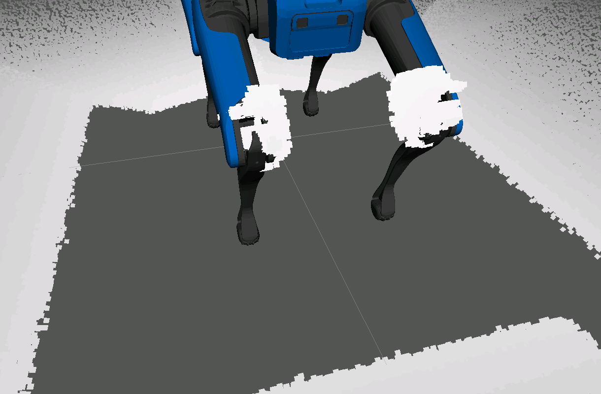
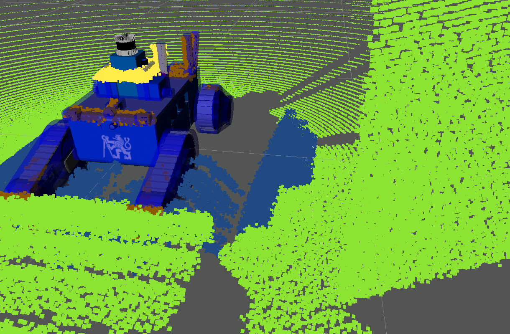

# Workshop on Pointcloud Filtering by Martin Pecka at ROSDevDay 2021

This is the code accompanying the video tutorial available at: https://www.youtube.com/watch?v=j0ljV0uZy3Q . The tutorial expects that you are working in a ROSJect on https://www.theconstructsim.com, but it can be easily adapted to local catkin workspaces.

This tutorial will guide participants through the configuration options of package **robot_body_filter**, which is a swiss-army knife for removing ego-points from laser scans and point clouds.

Github: https://github.com/peci1/robot_body_filter

Wiki: http://wiki.ros.org/robot_body_filter

Melodic package: ros-melodic-robot-body-filter

Noetic package: ros-noetic-robot-body-filter

# ROS install

This example is based on ROS Melodic. The simulator will only work
with Melodic, but robot_body_filter itself is also available in Noetic.

## SubT simulator install

This workshop uses Ignition Gazebo Dome and DARPA SubT simulator for examples. To install them, follow the install guide at

https://github.com/osrf/subt/wiki/Catkin%20System%20Setup

In this rosject, everything has already been installed and is in `~/subt_ws` .

This is not needed if you only want to work with BAG files.

## SubT simulator support packages install

To control the Spot and Lily robots in SubT simulator, a few support packages are needed. You will find them in `~/simulation_ws`.

This is not needed if you only want to work with BAG files.

## Alternative to installing simulator: BAG files

If you do not want to install the simulator, I've prepared bag files that contain a pre-recorded session where the robot was moving and all 3D sensors were captured. These BAG files are large (several GB), that is why they are not a part of the workspace here (free users are limited to about 2 GB of disk space). If you run the code locally, just add `gazebo:=false` to any roslaunch command mentioned here and the BAG file will be automatically downloaded and used instead of the simulator.

## robot_body_filter install

robot_body_filter is a package that provides multiple ways how to remove points on the robot's body from laser scans and pointclouds.

This is usually needed before you pass the 3D data to a mapper. Some
mappers can work even with the ego-points and remove them later as
dynamic obstacles, but it is a good manner to pass the mapper as nice
pointclouds as you can get.

On the other hand, removing too much points (like a complete bounding
sphere or box) is undesirable, as the close-by points are worth
considering in many cases.

robot_body_filter is available as a normal binary package, so to get
it, just `sudo apt install ros-melodic-robot-body-filter`, or add
`<exec_depend>robot_body_filter</exec_depend>` to your package's
package.xml.


## workspace for this tutorial

All custom code used for this tutorial is located in
`catkin_ws/src/rosdevday_cloud_filtering`.


Package `robot_body_filter` is also added to this workspace because for this workshop, we will use some features that are still pending release (branch `per_link_scaling`). When using a local checkout of the robot_body_filter package, it is essential to build it in `Release` mode. Debug builds are up to 100x slower, which makes the filter practically unusable for realtime use.

If you want to add also other optimizations to the build (like `-march=native`), make sure you build also package `geometric_shapes` with the same flags, otherwise you will get segfaults.

# Task 1: Robot Without Moving Parts

As a first task, we will try to configure robot_body_filter for a robot with no moving parts (except wheels). That is our Husky!

## What's the problem actually?

Open a terminal and launch the Husky in Ignition Gazebo:

    roslaunch --screen rosdevday_cloud_filtering common.launch robot:=husky rate:=0.1

Then open the "Graphical tools" window (lower toolbar of the web GUI),
wait a while until everything loads, and then display the "Lidar Original" pointcloud in RViz.

You will see that the lidar on top of the robot sees other things on the top deck!


## How do I solve the problem?

### Bad option: Increase minimum lidar distance

If you configure (in the robot's SDF for example) that all points closer than e.g. 30 cm are invalid, then you would get rid of the ego-points. However, you would also lose some points on proper obstacles in front of the robot!

And what's more, the lidar is not in the middle of the robot. So cutting out a sphere around the lidar means the sphere is either too large or too small, but it is never the smallest circumscribed sphere!

### Better option: Cut out a bounding box!

Try out the pcl_ros `CropBox` filter (keep the gazebo launch file running and type this into a second terminal window):

    rosrun nodelet nodelet standalone pcl/CropBox ~input:=/X1/points ~output:=/X1/points_filtered _keep_organized:=true _min_x:=-0.45 _max_x:=0.0 _min_y:=-0.3 _max_y:=0.3 _min_z:=-0.5 _max_z:=0.5 _negative:=true
    
Okay, that works, but the robot is not really box-like from a side view. Some obstacles would still be falsely removed (e.g. vertical rods in the height of the lidar).

But we are still filtering out a box centered in the lidar (and tilted!).

### Better option 2: Cut out a bounding box in the base_link frame

Set the `input_frame` parameter to the robot's base link (`X1`) so that the bounding box is centered on the robot body. That allows a tighter fit! Try this command in the second terminal instead of the previous one:
    
    rosrun nodelet nodelet standalone pcl/CropBox ~input:=/X1/points ~output:=/X1/points_filtered _keep_organized:=true _input_frame:=X1 _min_x:=-0.25 _max_x:=0.05 _min_y:=-0.3 _max_y:=0.3 _min_z:=-0.5 _max_z:=0.5 _negative:=true
    
So this works, but there's still the problem with the robot not being exactly box-shaped.


Moreover, on Melodic, there is a bug in pcl_ros, so that the pointcloud loses its organized structure even though `keep_organized` is set to true (Noetic does this correctly).

    $ rostopic echo -n 1 --noarr /X1/points_filtered
    header:
      seq: 11
      stamp:
        secs: 59
        nsecs: 600000000
      frame_id: "X1/sensor_rack/front_lidar"
    height: 1
    width: 27027
    
    $ rostopic echo -n 1 --noarr /X1/points
    header:
      seq: 1085
      stamp:
        secs: 109
        nsecs: 600000000
      frame_id: "X1/sensor_rack/front_lidar"
    height: 16
    width: 1800
    
### Best option: Use robot_body_filter

robot_body_filter is not a standalone node/nodelet - it is a filter following the paradigm of the `filters` ROS framework. This framework allows having multiple filters in a chain, all loaded as dynamic libraries into a single executable, passing shared pointers to each other, with no (de)serialization and network transmission.

To run the chain of filters for a PointCloud2 message type, we run the `pointcloud2_filter_chain` node from `sensor_filters` package. This node reads configuration of all filters from ROS parameters server, subscribes to pointclouds at topic `~input` and publishes the filtered result on topic `~output`.

You can try running it (again, in the second terminal window):

    rosrun sensor_filters pointcloud2_filter_chain ~input:=/X1/points ~output:=/X1/points_filtered
    
Hmm, this is not yet useful, because the chain of filters is empty. But you can see that all pointclouds get through the filter chain node.

Configuration of filters is usually saved into a YAML file that is loaded via a .launch file.

Here is the simplest config of robot_body_filter for Husky:

husky_simple.yaml:

```yaml
cloud_filter_chain:
-   name: body_filter
    type: robot_body_filter/RobotBodyFilterPointCloud2
    params:
        frames/filtering: 'X1'
        frames/output: 'X1/sensor_rack/front_lidar'
        sensor/min_distance: 0.05
        sensor/max_distance: 50.0
        body_model/inflation/scale: 1.1
        body_model/inflation/padding: 0.02
        filter/do_shadow_test: False
```

And you launch it from a .launch file like this (excerpt from `husky_simple.launch`):

```xml
<node name="laser_filter" pkg="sensor_filters" type="pointcloud2_filter_chain">
    <rosparam command="load" file="$(dirname)/../config/husky_simple.yaml" />

    <remap from="~input" to="points" />
    <remap from="~output" to="points_filtered" />
</node>
```

Try launching the following command to see it in action (stop both terminals and use only the first one from now on):

    roslaunch --screen rosdevday_cloud_filtering husky_simple.launch

We have got a filter that filters the clouds in the robot's base link frame. It first "inflates" the robot's collision model (read from parameter `robot_description`) by 10\%, then it adds 2 cm to all collision shapes, and finally removes all points that lie in the inflated robot model. We have turned shadow_testing off for now, we will talk about it later.

### Can we get tighter?

Yes we can! If you add option `debug/marker/contains: True` to the filter config and relaunch `husky_simple.launch`, you can enable `Model for contains test` in Rviz to see the shapes that get actually filtered out (the inflated ones). You can see that they are not as tight as possible.


We would like to decrease `body_model/inflation` as much as possible to get tighter, but still filter out the invalid points. We will also enable debugging pointclouds that show us which points are discarded, and a debugging model of the robot that is used for the filtering:

husky_tighter.yaml

```yaml
cloud_filter_chain:
-   name: body_filter
    type: robot_body_filter/RobotBodyFilterPointCloud2
    params:
        frames/filtering: 'X1'
        frames/output: 'X1/sensor_rack/front_lidar'
        sensor/min_distance: 0.05
        sensor/max_distance: 50.0
        body_model/inflation/scale: 1.01
        body_model/inflation/padding: 0.01
        body_model/inflation/per_link/scale:
            "X1/sensor_rack::collision_top": 1.2
        filter/do_shadow_test: False
        debug/pcl/inside: True
        debug/pcl/clip: True
        debug/marker/contains: True
```

Launch 

    roslaunch --screen rosdevday_cloud_filtering husky_tighter.launch

and you will see we could decrease the inflation from 110\% + 2 cm to 101\% + 1 cm. That's good. We have only increased the scale of a single collision body - a `<collision name="collision_top">` element of link `X1/sensor_rack`. You can find these elements in the URDF description of the robot. In case the collision does not have a name, you can simply use a numeric index in the order of appearance of the collisions, like `::0`. You also do not have to specify any collision name or index (no `::*`), which means the scaling/padding applies to all collision bodies of the specified link.

In RViz, you can see some points are brown now. That are the debug points showing what did the "contains" test filter out. Yellow points are those with distance less than `sensor/min_distance` (there are probably none in this case, you'll see them later). These debugging point clouds and markers are very useful when setting up the filter, but their publication takes CPU cycles, so it is suggested to turn them off in deployment.


# Task 2: Multiple Pointclouds and Moving Links

What if there are multiple pointclouds you need to filter the robot from? Or what if some parts of the robot can move? Let's have a look at such case on the Spot robot.

Boston Dynamics Spot has 5 grayscale and depth cameras on the body, and we have added a 3D lidar on its payload. That makes 6 pointclouds in total. How to configure the filter in such case?

Good news is that there is nothing to be done to support moving links. You get that out of the box!

## Multiple filter chains

Because of the paradigm imposed by the `filters` framework, there is no possibility to run one robot_body_filter for mutliple pointcloud sources and outputs. So we will need 6 independent filter chains:

spot_filter.launch:

```xml
<rosparam command="load" file="$(dirname)/../config/spot_filters.yaml" subst_value="true" />

<node name="laser_filter" pkg="sensor_filters" type="pointcloud2_filter_chain">
    <remap from="~input" to="points" />
    <remap from="~output" to="points_filtered" />
</node>

<node name="tof_back_filter" pkg="sensor_filters" type="pointcloud2_filter_chain">
    <remap from="~input" to="tof_back/depth/points" />
    <remap from="~output" to="tof_back/depth/points_filtered" />
</node>
<!-- similarly tof_left_filter, tof_right_filter, tof_frontleft_filter, tof_frontright_filter -->
```

spot_filters.yaml

```yaml
laser_filter:
    cloud_filter_chain:
    -   name: body_filter
        type: robot_body_filter/RobotBodyFilterPointCloud2
        params:
            frames/filtering: 'X1/base_link'
            frames/output: 'X1/laser/laser'
            sensor/min_distance: 0.2  # larger because of lidar rendering errors
            sensor/max_distance: 50.0
            ignored_links/bounding_sphere: ["X1/payload"]
            body_model/inflation/scale: 1.05
            body_model/inflation/padding: 0.01
            body_model/inflation/per_link/scale:
                "X1/payload": 1.1
            filter/do_shadow_test: False

tof_back_filter:
    cloud_filter_chain:
    -   name: body_filter
        type: robot_body_filter/RobotBodyFilterPointCloud2
        params:
            frames/filtering: 'X1/camera_back/back_depth'
            only_links: [
                    "X1/rear_left_upper_leg", "X1/rear_right_upper_leg",
                    "X1/rear_left_lower_leg", "X1/rear_right_lower_leg",
            ]
            body_model/inflation/padding: 0.15
            filter/do_clipping: False
            filter/do_shadow_test: False
            
# similarly for tof_left_filter, tof_right_filter, tof_frontleft_filter, tof_frontright_filter
```

You can see that we moved the `<rosparam load>` command one level higher, and there is one more level in the YAML config. The toplevel elements in the YAML config correspond to the names of the nodes that run the filter chains.

As the body-mounted depth cameras can only see very few links on the robot's body, we can slightly speed up the filter by setting the `only_links` parameter to the list of links to filter out. In this case, 4 links per camera are sufficient, and no other links are even considered.

Launch

    roslaunch --screen rosdevday_cloud_filtering spot_filter.launch

and see all the nicely filtered point clouds.


If you enable `Spot Depth Cameras` in RViz, you will see that the rear knees really need filtering. And if the robot moves, all legs do.



## Moving the robot

In case you run this workspace locally, you can just connect a gamepad (tested with Logitech F710) and control all the robots. Just hold LB or RB and use the left axis to control the motion. Spot and the tracked robots also react to hat arrows and right axis - try it out!

In case you cannot connect a gamepad, there are pre-recorded motion commands you can try to get the robot moving. Just pass `fake_teleop:=true` to any of the launch files and the robot will start moving! The simulation usually runs slower than realtime, but the recorded commands do not know how fast. So whenever you run `fake_teleop:=true`, you should also add `rate:=0.1` (or higher number if the simulation manages to run faster). Try out the fake teleop on the Absolem robot:

    roslaunch --screen rosdevday_cloud_filtering absolem_filter.launch fake_teleop:=true rate:=0.075

When you run Spot with teleoperation and lower the body (hat down on gamepad), you will see how much of the legs is needed to be filtered out...

At least in Ignition Gazebo, it is advised to test your filter with the robot rotating relative to the world in all possible directions, because both RGB and depth sensors have bugs which make them obstructed in some specific world poses (most visible should be when the robot is 45 degrees against the world).

# Task 3: Shadow Filtering

Shadows are basically invalid points in free space that are generated by light refraction on edges of the robot's body. In simulation, there is nothing like refraction, but several settings can lead to these points being generated, too (like additive gaussian noise). Shadow filter is basically a raytracer that casts a ray from each measured point towards the sensor. If this ray goes through the robot's (inflated) body, the ray is considered invalid and is filtered out. Using the shadow filter allows to keep the collision model tight while still removing the shadow points relatively far from the robot body.


Raytracing is a relatively expensive computational operation, so always verify if your filter is realtime-capable if you enable shadow filtering. What helps is ignoring links that physically can't be seen by the lidar and thus cannot generate any shadow points. It also helps to keep the robot model simple and made of basic geometric shapes instead of meshes, or at least decreasing the mesh resolution. Also take into account that robot_body_filter always uses convex hulls of meshes, so if you use non-convex meshes, you have to either subdivide them into several convex parts, or count with the fact that it is the convex hull that is used. There is also a setting for maximum distance of the points considered for shadow filtering, and this can help a lot if a large portion of the pointclouds is far from the sensor (we assume the body-generated shadow points are all located nearby the robot's body).

One important thing to remember when using shadow filtering - you always have to set the lidar's collision link as ignored (because all rays intersect the lidar's collision element).

Let's have a look at the settings for MARV robot, whose flippers sometimes generate shadow points in simulation (when they are lifted up), and always generate lots of shadow points on the real robot (on the edges of the flippers).


marv_filters.yaml:

```yaml
cloud_filter_chain:
-   name: body_filter
    type: robot_body_filter/RobotBodyFilterPointCloud2
    params:
        frames/filtering: 'X1/laser/laser'
        sensor/min_distance: 0.22  # larger because of lidar rendering errors
        sensor/max_distance: 50.0
        ignored_links/contains_test: [
                "X1/battery1", "X1/battery2",
                "X1/front_cam", "X1/rear_cam",
                "X1/base_link::1", "X1/base_link::2", "X1/base_link::3",
        ]
        ignored_links/shadow_test: [
                "X1/laser", "X1/top_box::0",
                "X1/battery1", "X1/battery2",
                "X1/camera1", "X1/camera3",
                "X1/front_cam", "X1/rear_cam",
                "X1/base_link::1", "X1/base_link::2", "X1/base_link::3",
        ]
        body_model/inflation/scale: 1.01
        body_model/inflation/padding: 0.01
        body_model/inflation/per_link/padding:
            "X1/mobilicom_antenna_l::contains": 0.07
            "X1/mobilicom_antenna_r::contains": 0.07
            "X1/base_link::0::contains": 0.07
            "X1/front_left_flipper::contains": 0.03
            "X1/front_right_flipper::contains": 0.03
            "X1/rear_left_flipper::contains": 0.03
            "X1/rear_right_flipper::contains": 0.03
            "X1/camera_4::shadow": 0.0
        filter/do_shadow_test: True
        filter/max_shadow_distance: 1.0
        debug/pcl/inside: True
        debug/pcl/clip: True
        debug/pcl/shadow: True
        debug/marker/shadow: True
```

Run

    roslaunch --screen rosdevday_cloud_filtering marv_filter.launch

and see this in action. You can see now that some points are blue in RViz, and those are the shadow points. Try moving the flippers (or run the fake teleop) to see the shadow points nearby flippers. If you enable the `Model for shadow test` entry, you will see the inflated robot model used for filtering shadow points (the shadow-detecting rays are cast from the sensor frame, i.e. the center of the lidar).



A few points of interest in the config:

- there is a new list `ignored_links/shadow_test` for links ignored in the shadow filter. Add as much links here as possible. Especially, do not forget the sensor link! (`X1/laser` in this case)
    - you can test what would happen if you do not exclude the sensor link
- entries in the `body_model/inflation/per_link/padding` have suffixes `::contains` and `::shadow`. These do not refer to collision names, but they are suffixes that specify that the padding should only be altered in the model used for contains/shadow test. If you want to specify both a collision name/index and this suffix, then put the collision name first and the contains/shadow suffix at the very end (as e.g. `X1/base_link::0::contains`).
- we have set `filter/max_shadow_distance` to 1 meter, which means only points up to 1 meter from the sensor are tested for being shadow points... if we would not specify this, the filter would not be realtime-capable.
- we would not need to specify `filter/do_shadow_test: True` as `True` is the default. Remeber this when creating your own filters - shadow filtering is ON by default.


# Bonus Task 4: 2D LaserScan and Real Robot Data

What if your robot produces `sensor_msgs/LaserScan` messages instead of pointclouds? No worry, robot_body_filter supports these natively! Let's have a look at the config for Absolem robot which has a rotating 2D lidar:

absolem_filters.yaml

```yaml
scan_filter_chain:
-   name: RobotBodyFilter
    type: robot_body_filter/RobotBodyFilterLaserScan
    params:
        frames/filtering: 'X1/base_link'
        sensor/point_by_point: False
        sensor/min_distance: 0.03
        sensor/max_distance: 50.0
        ignored_links/shadow_test: ["X1/laser", "X1/base_link::big_collision_box"]
        body_model/inflation/scale: 1.07
        body_model/inflation/padding: 0.01
```

and launch the filter chain with the following (excerpt from `absolem_filter.launch`):

```xml
<node name="laser_filter" pkg="sensor_filters" type="laserscan_filter_chain">
    <remap from="~input" to="front_scan" />
    <remap from="~output" to="front_scan_filtered" />
</node>
```

Notice the difference in the first 3 lines of the YAML config. It is no longer `cloud_filter_chain`, but `scan_filter_chain`. The `type` field of the filter is also different. And the filter chain runner from `sensor_filters` is also different.

In the YAML config, you can see we set `sensor/point_by_point` to `False`. Usually, lidar sensors do not capture the whole "measurement" in one instant, but capture it gradually over some time frame. The robot can move in the meantime, which means not all points are captured at the same time and from the same viewpoint! If you want precise filtering, this setting needs to be set to `True`. However, the simulated lidar acts more like a depth camera, so it actually captures all the measurements in one instant. Due to the nature of sensors, `sensor/point_by_point` defaults to `True` for laser scans and to `False` for pointclouds.

Setting this to `True` means that the robot pose is recomputed for several time instants during the capture of the scan. How often that happens is configured by `filter/model_pose_update_interval`. Do not set this too low, as it might become computationally pretty intensive (imagine recomputing the poses of all links e.g. for filtering of each measured ray).

If you set `point_by_point` to `True`, there is also need for setting the fixed frame (`frames/fixed`). That is a frame that doesn't move during the capture of the scan. For mobile robots, it would most probably be `odom` frame.

## Real robot config

Here is an excerpt from our configuration of the filter for the real Absolem robot. The scans come at 50 Hz with approx. 700 points each. With `filter/model_pose_update_interval` set to 2 milliseconds, this means the robot pose is updated 10 times during processing each scan - that gives a pose update each 70 points. As the flipper movements are not that fast, this is more than enough to get a precise filtering result (we won the 3rd place in SubT challenge with this setting, in the end :) ).

absolem_real_filters.yaml:

```yaml
scan_filter_chain:
-   name: RobotBodyFilter
    type: robot_body_filter/RobotBodyFilterLaserScan
    params:
        frames/fixed: 'odom'
        frames/sensor: 'laser'
        filter/model_pose_update_interval: 0.002  # do not get lower, the processing is then too slow
        sensor/point_by_point: True
        sensor/min_distance: 0.03
        sensor/max_distance: 50.0
        ignored_links/bounding_sphere: ["antenna", "base_link::big_collision_box"]
        ignored_links/shadow_test: ["laser", "base_link::big_collision_box"]
        body_model/inflation/scale: 1.07
        body_model/inflation/padding: 0.01

```

You can launch 

    roslaunch --screen rosdevday_cloud_filtering    absolem_real_filter.launch
    
to automatically play a bag file recorded on the real robot and apply the filter to it. You can see that on the edges of the flippers, there are very much shadow points caused by light refraction.

# Bonus Task 5: Bounding Boxes and Spheres

In some cases, it is practical to know dimensions of the robot's bounding box or bounding sphere (e.g. for coarse path planning to figure out if the robot fits in a narrow corridor). As robot_body_filter heavily uses the robot model, these bounding shapes come as a relatively cheap-to-compute byproduct. All the bounding shapes (except local bounding box) are expressed relative to the filtering frame.

## Bounding sphere

Bounding sphere is defined as a sphere that contains the whole robot body. The one that results from robot_body_filter is not the tightest possible one - it is the bounding sphere of the bounding spheres of all collision elements. So it might be a bit inflated, but that should not be too much. The bounding sphere can have its center shifted from the origin of filtering frame, so it should not matter that you filter in a frame that is not close to the robot centroid.

To enable computation of the bounding sphere, set `bounding_sphere/compute` to `True`. You can then get the computed dimensions on topic `robot_bounding_sphere`.


## Axis-aligned bounding box

Axis-aligned bounding box has its axes aligned to the filtering frame. As in the case of bounding spheres, it is not as tight as possible, but instead a bounding box of bounding boxes of all collision elements. But it's usually quite okay.

To enable computation of the axis-aligned bounding box, set `bounding_box/compute` to `True`. You can then get the computed dimensions on topic `robot_bounding_box`. It is published as a 2-point polygon, where the first point is the minimal point and the second point is the maximal point.


## Local bounding box

This is an axis-aligned bounding box, but aligned to a frame of choice (selected by `local_bounding_box/frame_id`). This is useful if the filtering frame is not the same frame in which you want the bounding box expressed.

To enable computation of the local bounding box, set `local_bounding_box/compute` to `True`. You can then get the computed dimensions on topic `robot_local_bounding_box`. It is published as a 2-point polygon, where the first point is the minimal point and the second point is the maximal point.

## Oriented bounding box

An oriented bounding box is not necessarily aligned to any axes. It should be the tightest box that encloses the robot body. However, this task has many possible solutions, so consider this option only experimental and do not rely on it very much. It might yield very unexpected results in some corner cases.

To enable computation of the oriented bounding box, set `oriented_bounding_box/compute` to `True`. You can then get the computed dimensions on topic `robot_oriented_bounding_box`. It is published as a pair of pose and extents (dimensions in the frame gotten after applying pose to the filtering frame).

## Debugging bounding shapes

All bounding shapes offer several debug options. We'll show them on the example of bounding sphere:

- `bounding_sphere/marker`: publishes a marker representing the sphere for display in RViz
- `bounding_sphere/debug`: publishes a marker array of all bounding spheres of all collision elements
- `bounding_sphere/publish_cut_out_pointcloud`: if `True`, publishes topic `scan_point_cloud_no_bsphere` where is a pointcloud containing all points that are outside the computed bounding sphere


## Configuring robot model inflation for bounding shapes

As with the `::contains` and `::shadow` suffixes to per-link scaling/padding, there are also suffixes `::bounding_sphere`, `::bounding_box`, that apply different scaling for computation of the bounding sphere/box. There are also options `ignored_links/bounding_sphere`, `body_model/inflation/bounding_sphere/scale`, `body_model/inflation/bounding_sphere/padding` and analogous for bounding box. 
